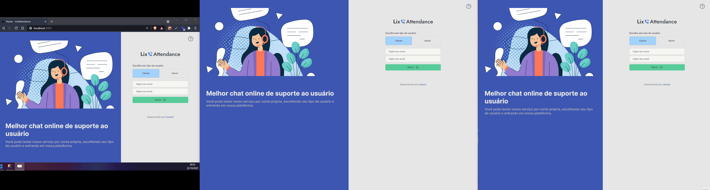

<h1 align="center">
  
</h1>

<p align="center">
  <a href="#description">Description</a>&nbsp;&nbsp;&nbsp;|&nbsp;&nbsp;&nbsp;
  <a href="#requirements">Requirements</a>&nbsp;&nbsp;&nbsp;|&nbsp;&nbsp;&nbsp;
  <a href="#technologies">Technologies</a>&nbsp;&nbsp;&nbsp;|&nbsp;&nbsp;&nbsp;
  <a href="#usage">Usage</a>&nbsp;&nbsp;&nbsp;|&nbsp;&nbsp;&nbsp;
  <a href="#demonstration">Demonstration</a>
</p>
<br />
<p align="center">
  
  
  
  
  
  
  
</p>

<p align="center">
  <a href="https://github.com/Lissone/lix-attendance/issues">Report bug</a>
  ·
  <a href="https://github.com/Lissone/lix-attendance/issues">Request feature</a>
</p>

<br />

## Description

Project developed with the intention of deepening knowledge in websockets with real-time applications and integration with htttp servers.
It consists of a support chat site between customer with question and admin respondent, where admin can choose customer he wants to respond according to priority (based on time of message sent), and close his connection once queries are answered . Anyone can test the application in order to contract the service for their own website by contacting the responsible developer (myself).
The first version of the project was developed at the Next Level Week 5 (NLW) marathon, taught by Daniela Leão, from April 19 to 25, 2021.

## Requirements

* [Yarn](https://yarnpkg.com/)
* [Nodejs](https://nodejs.org/en/)
* [SqlServer](https://www.microsoft.com/pt-br/sql-server/sql-server-downloads)

## Technologies

### Backend (Api)
* NodeJs
* Typescript
* Express
* Socket.io
* TypeORM
* SqlServer
* ESLint

### Front End
* Next
* Typescript
* StyledComponents
* Socket.io-client
* ESLint (Airbnb config + pessoal rules)
* Prettier

## Usage

You can use this project as a template for another one, or clone it on your pc using the command:

```bash
git clone https://github.com/Lissone/lix-attendance.git
cd lix-attendance
```

Install dependencies using:
```bash
yarn
#or
npm run
```

### Database configuration

You must create the database before running an api (dbLixAttendance).

```typescript
// .\src\external\database\dbConfig.ts

const connection = createConnection({
  type: 'mssql',
  host: process.env.DB_HOST,
  port: 1433,
  username: process.env.DB_USERNAME,
  password: process.env.DB_PASSWORD,
  database: process.env.DB_NAME,
  entities: [**Entities**],
  synchronize: true,
  logging: false,
  options: {
    enableArithAbort: true
  }
})
```

Need to add environment variables in both projects:

```bash
# .\packages\web\.env.local

# DEFAULT
NEXT_PUBLIC_BASE_URL_API=http://localhost:5000
```

```bash
# .\packages\api\.env

# DEFAULT
PORT=5000
DB_USERNAME=sa
DB_PASSWORD=123456
DB_NAME=dbLixAttendance
DB_HOST=localhost
```

Run api:
```bash
cd .\packages\api\
yarn dev
#or
npm run dev
```

Run web:
```bash
cd .\packages\web\
yarn dev
#or
npm run dev
```

## Demonstration



## License

Distributed under the MIT License. See `LICENSE` for more information.

<h4 align="center">
  Made with ❤️ by <a href="https://github.com/Lissone" target="_blank">Lissone</a>
</h4>

<hr />
